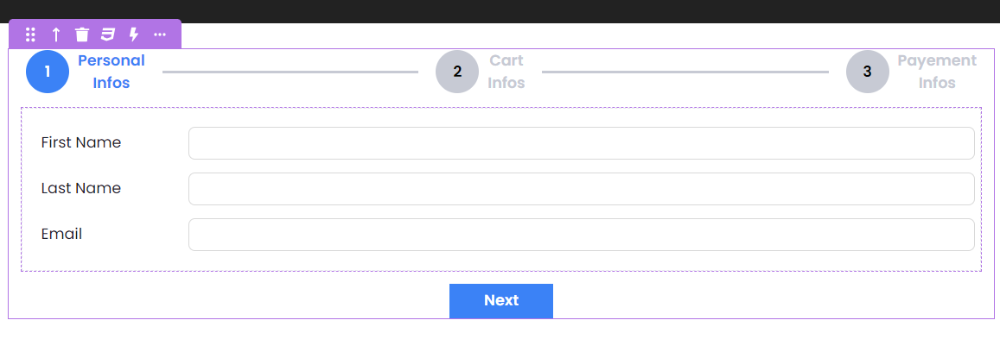
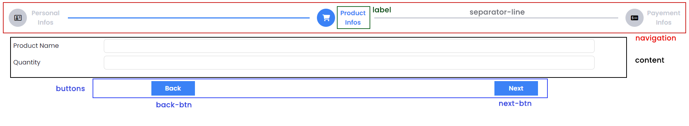

# Overview

**Stepper** is a component commonly used to guide users through a series of steps or stages in a sequential manner. It's often seen in multi-step forms, wizards, or any process that requires a user to complete several steps to reach a goal.

# Stepper Component



### Properties

| Name                 | Type                               | Default   | Description                                                                    |
| -------------------- | ---------------------------------- | --------- | ------------------------------------------------------------------------------ |
| **`Linear`**         | `Boolean`                          | `False`   | If true, the user can only navigate the steps using the Next and Back buttons. |
| **`Label Position`** | `Top`, `Bottom`, `Left` or `Right` | `Right`   | Sets the position of the step's label.                                         |
| **`Active Color`**   | `String`                           | `#3b82f6` | Sets the color of the active step (the selected step).                         |
| **`Inactive Color`** | `String`                           | `#c7cad4` | Sets the color of the inactive steps.                                          |
| **`Step Style`**     | 'icon' or 'Text'                   | `Text`    | Defines the style of the step's title.                                         |
| **`Steps`**          | `Array`                            |           | Defines the steps of the our component.                                        |

### Custom CSS



```css
self .separator-line {
  display: none;
}

self .label:hover {
  background-color: gold;
}

self .buttons {
  display: none;
}
```
